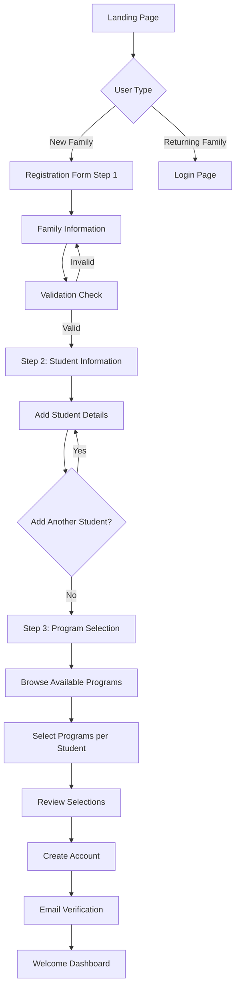
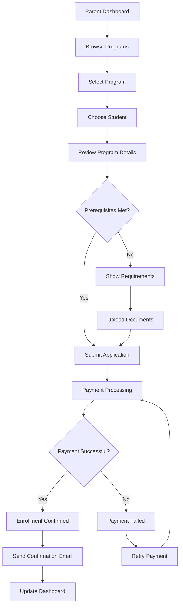

# Learner Portal Family Enrollment System
## Comprehensive Implementation Plan

---

## 1. System Overview

The Learner Portal is a dedicated parent-facing application that enables families to register, manage their profiles, and enroll children in available programs. This system operates alongside the existing Admin panel while sharing the same database infrastructure.

### Key Objectives
- Streamlined family registration and student enrollment process
- Self-service portal for parents to manage their family's educational journey
- Seamless integration with existing admin systems
- Scalable architecture supporting future enhancements

---

## 2. High-Level System Architecture

```
┌─────────────────────────────────────────────────────────────┐
│                    Frontend Layer                           │
├─────────────────────┬───────────────────────────────────────┤
│   Admin Panel       │        Learner Portal                 │
│   (Existing)        │        (New)                          │
│                     │                                       │
│ - User Management   │ - Family Registration                 │
│ - Program Admin     │ - Student Enrollment                  │
│ - Financial Mgmt    │ - Profile Management                  │
│ - Reporting         │ - Payment Processing                  │
└─────────────────────┴───────────────────────────────────────┘
                              │
┌─────────────────────────────────────────────────────────────┐
│                 Shared Services Layer                       │
├─────────────────────────────────────────────────────────────┤
│ - Authentication Service (Firebase Auth)                   │
│ - Database Services (Firestore)                            │
│ - Email/Notification Service                               │
│ - Payment Processing Service                               │
│ - File Storage Service                                      │
└─────────────────────────────────────────────────────────────┘
                              │
┌─────────────────────────────────────────────────────────────┐
│                    Database Layer                           │
├─────────────────────────────────────────────────────────────┤
│ Firebase Firestore Collections:                            │
│ - users (shared)                                           │
│ - families (shared)                                        │
│ - students (shared)                                        │
│ - programs (shared)                                        │
│ - offerings (shared)                                       │
│ - enrollments (shared)                                     │
│ - applications (new)                                       │
│ - notifications (new)                                      │
└─────────────────────────────────────────────────────────────┘
```

---

## 3. Database Schema Modifications

### 3.1 New Collections

#### Applications Collection
```typescript
interface Application {
  id: string;
  familyId: string;
  studentId: string;
  offeringId: string;
  status: 'pending' | 'approved' | 'rejected' | 'waitlisted';
  applicationDate: Date;
  approvedBy?: string;
  approvedDate?: Date;
  rejectionReason?: string;
  priority: number;
  documents: {
    name: string;
    url: string;
    uploadedAt: Date;
  }[];
  notes?: string;
  createdAt: Date;
  updatedAt: Date;
}
```

#### Notifications Collection
```typescript
interface Notification {
  id: string;
  userId: string;
  type: 'enrollment' | 'payment' | 'schedule' | 'general';
  title: string;
  message: string;
  isRead: boolean;
  actionUrl?: string;
  createdAt: Date;
  expiresAt?: Date;
}
```

### 3.2 Enhanced Existing Collections

#### Users Collection Enhancement
```typescript
// Add to existing User interface
interface User {
  // ... existing fields
  preferences: {
    emailNotifications: boolean;
    smsNotifications: boolean;
    language: string;
  };
  lastLoginAt?: Date;
  profileCompleteness: number; // 0-100%
}
```

#### Families Collection Enhancement
```typescript
// Add to existing Family interface
interface Family {
  // ... existing fields
  emergencyContact?: {
    name: string;
    relationship: string;
    phone: string;
    email?: string;
  };
  medicalInfo?: {
    allergies: string[];
    medications: string[];
    emergencyMedicalInfo?: string;
  };
  preferences: {
    communicationMethod: 'email' | 'phone' | 'both';
    newsletterSubscription: boolean;
  };
  registrationSource: 'admin' | 'parent_portal' | 'referral';
}
```

---

## 4. User Interface Design

### 4.1 Key Screens Wireframes

#### Landing Page
```
┌─────────────────────────────────────────────────────────────┐
│ [Logo] Hunicker Institute: Band and Beyond    [Login] [Sign Up] │
├─────────────────────────────────────────────────────────────┤
│                                                             │
│           Welcome to Your Musical Journey                   │
│                                                             │
│  ┌─────────────────┐  ┌─────────────────┐  ┌─────────────────┐ │
│  │   New Family    │  │  Returning      │  │   Browse        │ │
│  │   Registration  │  │  Family Login   │  │   Programs      │ │
│  │                 │  │                 │  │                 │ │
│  │ [Get Started]   │  │ [Sign In]       │  │ [View Programs] │ │
│  └─────────────────┘  └─────────────────┘  └─────────────────┘ │
│                                                             │
│  Featured Programs:                                         │
│  • Private Lessons  • Homeschool Music  • Band Program     │
└─────────────────────────────────────────────────────────────┘
```

#### Family Registration Form
```
┌─────────────────────────────────────────────────────────────┐
│ Family Registration - Step 1 of 3                          │
├─────────────────────────────────────────────────────────────┤
│                                                             │
│ Family Information                                          │
│ ┌─────────────────────────────────────────────────────────┐ │
│ │ Family Name: [________________]                         │ │
│ │                                                         │ │
│ │ Primary Contact                                         │ │
│ │ Full Name: [________________] Email: [________________] │ │
│ │ Phone: [________________]                               │ │
│ │                                                         │ │
│ │ Secondary Contact (Optional)                            │ │
│ │ Full Name: [________________] Email: [________________] │ │
│ │ Phone: [________________]                               │ │
│ │                                                         │ │
│ │ Address                                                 │ │
│ │ Street: [_____________________________________]         │ │
│ │ City: [____________] State: [____] ZIP: [_______]       │ │
│ └─────────────────────────────────────────────────────────┘ │
│                                                             │
│                              [Cancel] [Next: Add Students] │
└─────────────────────────────────────────────────────────────┘
```

#### Student Information Form
```
┌─────────────────────────────────────────────────────────────┐
│ Family Registration - Step 2 of 3                          │
├─────────────────────────────────────────────────────────────┤
│                                                             │
│ Student Information                                         │
│                                                             │
│ Student 1                                    [Remove]       │
│ ┌─────────────────────────────────────────────────────────┐ │
│ │ First Name: [____________] Last Name: [____________]    │ │
│ │ Date of Birth: [__/__/____] Grade: [_______]           │ │
│ │ Email: [________________________]                      │ │
│ │ Primary Instrument Interest: [________________]         │ │
│ │ Experience Level: [Beginner ▼]                         │ │
│ │ Special Notes: [_________________________________]      │ │
│ └─────────────────────────────────────────────────────────┘ │
│                                                             │
│ [+ Add Another Student]                                     │
│                                                             │
│                         [Back] [Next: Select Programs]     │
└─────────────────────────────────────────────────────────────┘
```

#### Program Selection & Enrollment
```
┌─────────────────────────────────────────────────────────────┐
│ Family Registration - Step 3 of 3                          │
├─────────────────────────────────────────────────────────────┤
│                                                             │
│ Select Programs for Your Students                           │
│                                                             │
│ ┌─────────────────────────────────────────────────────────┐ │
│ │ John Smith (Age 10, Grade 5)                           │ │
│ │                                                         │ │
│ │ Available Programs:                                     │ │
│ │ ☐ Piano Lessons - Fall 2024    $60/lesson             │ │
│ │ ☐ Beginner Band - Fall 2024    $120/month             │ │
│ │ ☑ Homeschool Music - Fall 2024 $80/month              │ │
│ │                                                         │ │
│ │ Selected Total: $80/month                               │ │
│ └─────────────────────────────────────────────────────────┘ │
│                                                             │
│ ┌─────────────────────────────────────────────────────────┐ │
│ │ Sarah Smith (Age 8, Grade 3)                           │ │
│ │                                                         │ │
│ │ Available Programs:                                     │ │
│ │ ☑ Piano Lessons - Fall 2024    $60/lesson             │ │
│ │ ☐ Beginner Band - Fall 2024    $120/month             │ │
│ │                                                         │ │
│ │ Selected Total: $60/lesson                              │ │
│ └─────────────────────────────────────────────────────────┘ │
│                                                             │
│ Family Total: $80/month + $60/lesson                        │
│                                                             │
│                    [Back] [Complete Registration]          │
└─────────────────────────────────────────────────────────────┘
```

#### Parent Dashboard
```
┌─────────────────────────────────────────────────────────────┐
│ [Logo] Welcome, Johnson Family          [Profile] [Logout]  │
├─────────────────────────────────────────────────────────────┤
│                                                             │
│ ┌─────────────────┐ ┌─────────────────┐ ┌─────────────────┐ │
│ │ My Students (2) │ │ Enrollments (3) │ │ Payments Due    │ │
│ │                 │ │                 │ │                 │ │
│ │ • John (Active) │ │ • Piano Lessons │ │ $140.00         │ │
│ │ • Sarah (Active)│ │ • Band Program  │ │ Due: Oct 15     │ │
│ │                 │ │ • Music Theory  │ │                 │ │
│ │ [Manage]        │ │ [View Details]  │ │ [Pay Now]       │ │
│ └─────────────────┘ └─────────────────┘ └─────────────────┘ │
│                                                             │
│ Recent Activity                                             │
│ • John's piano lesson scheduled for Oct 12, 3:00 PM        │
│ • Payment received for September tuition                    │
│ • New recital announcement available                        │
│                                                             │
│ Quick Actions                                               │
│ [Enroll in New Program] [Update Family Info] [Contact Us]  │
└─────────────────────────────────────────────────────────────┘
```

---

## 5. Step-by-Step User Flow Documentation

### 5.1 New Family Registration Flow



### 5.2 Enrollment Process Flow



---

## 6. Technical Implementation Approach

### 6.1 Frontend Architecture

#### Technology Stack
- **Framework**: React 18 with TypeScript
- **Routing**: React Router v6
- **State Management**: React Context + useReducer for complex state
- **Styling**: Tailwind CSS (consistent with existing admin panel)
- **Form Management**: React Hook Form with Zod validation
- **HTTP Client**: Firebase SDK (consistent with existing architecture)

#### Project Structure
```
src/
├── components/
│   ├── learner/
│   │   ├── auth/
│   │   │   ├── LoginForm.tsx
│   │   │   ├── RegisterForm.tsx
│   │   │   └── ForgotPassword.tsx
│   │   ├── dashboard/
│   │   │   ├── ParentDashboard.tsx
│   │   │   ├── StudentCard.tsx
│   │   │   ├── EnrollmentCard.tsx
│   │   │   └── PaymentCard.tsx
│   │   ├── enrollment/
│   │   │   ├── ProgramBrowser.tsx
│   │   │   ├── EnrollmentForm.tsx
│   │   │   ├── PaymentForm.tsx
│   │   │   └── ConfirmationPage.tsx
│   │   ├── profile/
│   │   │   ├── FamilyProfile.tsx
│   │   │   ├── StudentProfile.tsx
│   │   │   └── PreferencesForm.tsx
│   │   └── common/
│   │       ├── LearnerLayout.tsx
│   │       ├── Navigation.tsx
│   │       └── LoadingSpinner.tsx
│   └── shared/ (components used by both admin and learner)
├── hooks/
│   ├── useLearnerAuth.ts
│   ├── useEnrollment.ts
│   ├── usePayments.ts
│   └── useNotifications.ts
├── services/
│   ├── learnerService.ts
│   ├── enrollmentService.ts
│   ├── paymentService.ts
│   └── notificationService.ts
├── types/
│   ├── learner.ts
│   ├── enrollment.ts
│   └── payment.ts
└── utils/
    ├── validation.ts
    ├── formatting.ts
    └── constants.ts
```

### 6.2 Backend Services

#### Firebase Functions (New)
```typescript
// Enrollment processing function
export const processEnrollment = functions.firestore
  .document('applications/{applicationId}')
  .onCreate(async (snap, context) => {
    const application = snap.data();
    
    // Validate enrollment capacity
    // Process payment
    // Send notifications
    // Update enrollment status
  });

// Payment processing webhook
export const handlePaymentWebhook = functions.https
  .onRequest(async (req, res) => {
    // Handle Stripe webhook
    // Update payment status
    // Send confirmation emails
  });

// Notification service
export const sendNotifications = functions.pubsub
  .schedule('every 24 hours')
  .onRun(async (context) => {
    // Send reminder emails
    // Process scheduled notifications
  });
```

### 6.3 Authentication & Authorization

#### Role-Based Access Control
```typescript
interface UserRole {
  type: 'admin' | 'teacher' | 'parent' | 'student';
  permissions: Permission[];
  familyId?: string; // For parents and students
}

interface Permission {
  resource: string;
  actions: ('create' | 'read' | 'update' | 'delete')[];
  conditions?: Record<string, any>;
}

// Example permissions for parents
const parentPermissions: Permission[] = [
  {
    resource: 'family',
    actions: ['read', 'update'],
    conditions: { familyId: 'user.familyId' }
  },
  {
    resource: 'students',
    actions: ['read', 'update'],
    conditions: { familyId: 'user.familyId' }
  },
  {
    resource: 'enrollments',
    actions: ['create', 'read'],
    conditions: { familyId: 'user.familyId' }
  }
];
```

---

## 7. Security Considerations

### 7.1 Data Protection
- **PII Encryption**: All personally identifiable information encrypted at rest
- **HTTPS Only**: All communications over secure connections
- **Input Validation**: Comprehensive client and server-side validation
- **SQL Injection Prevention**: Parameterized queries and Firestore security rules
- **XSS Protection**: Content Security Policy and input sanitization

### 7.2 Authentication Security
- **Multi-Factor Authentication**: Optional 2FA for enhanced security
- **Password Requirements**: Strong password policies
- **Session Management**: Secure session handling with automatic timeout
- **Account Lockout**: Protection against brute force attacks

### 7.3 Firestore Security Rules
```javascript
rules_version = '2';
service cloud.firestore {
  match /databases/{database}/documents {
    // Families can only be accessed by family members or admins
    match /families/{familyId} {
      allow read, write: if request.auth != null && 
        (resource.data.primaryContactEmail == request.auth.token.email ||
         resource.data.secondaryContactEmail == request.auth.token.email ||
         get(/databases/$(database)/documents/users/$(request.auth.uid)).data.role == 'admin');
    }
    
    // Students can only be accessed by their family or admins
    match /students/{studentId} {
      allow read, write: if request.auth != null && 
        (resource.data.familyId in get(/databases/$(database)/documents/users/$(request.auth.uid)).data.familyIds ||
         get(/databases/$(database)/documents/users/$(request.auth.uid)).data.role == 'admin');
    }
    
    // Applications can only be created by parents, read by admins
    match /applications/{applicationId} {
      allow create: if request.auth != null && 
        get(/databases/$(database)/documents/users/$(request.auth.uid)).data.role == 'parent';
      allow read, update: if request.auth != null && 
        (resource.data.familyId in get(/databases/$(database)/documents/users/$(request.auth.uid)).data.familyIds ||
         get(/databases/$(database)/documents/users/$(request.auth.uid)).data.role in ['admin', 'teacher']);
    }
  }
}
```

---

## 8. Data Validation Requirements

### 8.1 Client-Side Validation (Zod Schemas)
```typescript
import { z } from 'zod';

export const FamilyRegistrationSchema = z.object({
  familyName: z.string().min(2, 'Family name must be at least 2 characters'),
  primaryContact: z.object({
    name: z.string().min(2, 'Name is required'),
    email: z.string().email('Valid email is required'),
    phone: z.string().regex(/^\(\d{3}\) \d{3}-\d{4}$/, 'Phone must be in format (123) 456-7890')
  }),
  secondaryContact: z.object({
    name: z.string().optional(),
    email: z.string().email().optional().or(z.literal('')),
    phone: z.string().regex(/^\(\d{3}\) \d{3}-\d{4}$/).optional().or(z.literal(''))
  }).optional(),
  address: z.object({
    street: z.string().min(5, 'Street address is required'),
    city: z.string().min(2, 'City is required'),
    state: z.string().length(2, 'State must be 2 characters'),
    zipCode: z.string().regex(/^\d{5}(-\d{4})?$/, 'Invalid ZIP code')
  })
});

export const StudentRegistrationSchema = z.object({
  firstName: z.string().min(2, 'First name is required'),
  lastName: z.string().min(2, 'Last name is required'),
  dateOfBirth: z.date().max(new Date(), 'Birth date cannot be in the future'),
  grade: z.string().optional(),
  email: z.string().email().optional().or(z.literal('')),
  instrument: z.string().optional(),
  skillLevel: z.enum(['beginner', 'intermediate', 'advanced']),
  notes: z.string().max(500, 'Notes cannot exceed 500 characters').optional()
});
```

### 8.2 Server-Side Validation
```typescript
// Firebase Functions validation
export const validateEnrollmentData = (data: any): ValidationResult => {
  const errors: string[] = [];
  
  // Validate student exists and belongs to family
  if (!data.studentId || !data.familyId) {
    errors.push('Student and family information required');
  }
  
  // Validate program availability
  if (!data.offeringId) {
    errors.push('Program selection required');
  }
  
  // Validate enrollment capacity
  // Validate prerequisites
  // Validate payment information
  
  return {
    isValid: errors.length === 0,
    errors
  };
};
```

---

## 9. Development Timeline & Phases

### Phase 1: Foundation (Weeks 1-3)
**Week 1: Project Setup & Architecture**
- Set up development environment
- Create project structure
- Configure Firebase services
- Set up CI/CD pipeline

**Week 2: Authentication & User Management**
- Implement user registration/login
- Set up role-based access control
- Create user profile management
- Implement password reset functionality

**Week 3: Database Schema & Services**
- Deploy database schema changes
- Create service layer for data access
- Implement Firestore security rules
- Set up data validation

### Phase 2: Core Functionality (Weeks 4-7)
**Week 4: Family Registration**
- Build family registration form
- Implement multi-step wizard
- Add form validation and error handling
- Create family profile management

**Week 5: Student Management**
- Build student registration forms
- Implement student profile management
- Add student-family relationship handling
- Create student dashboard components

**Week 6: Program Browsing & Selection**
- Build program catalog interface
- Implement filtering and search
- Create program detail views
- Add enrollment capacity checking

**Week 7: Enrollment Process**
- Build enrollment application forms
- Implement enrollment workflow
- Add document upload functionality
- Create enrollment status tracking

### Phase 3: Advanced Features (Weeks 8-10)
**Week 8: Payment Integration**
- Integrate payment processing
- Build payment forms and flows
- Implement payment history
- Add billing management

**Week 9: Notifications & Communications**
- Build notification system
- Implement email templates
- Add in-app messaging
- Create communication preferences

**Week 10: Dashboard & Reporting**
- Build parent dashboard
- Create enrollment summaries
- Add progress tracking
- Implement basic reporting

### Phase 4: Testing & Deployment (Weeks 11-12)
**Week 11: Testing & Quality Assurance**
- Comprehensive testing (unit, integration, e2e)
- Security testing and penetration testing
- Performance optimization
- Accessibility compliance testing

**Week 12: Deployment & Launch**
- Production deployment
- User acceptance testing
- Staff training
- Go-live support

---

## 10. Integration with Existing Systems

### 10.1 Data Synchronization
- **Real-time Updates**: Use Firestore real-time listeners for live data sync
- **Conflict Resolution**: Implement optimistic locking for concurrent updates
- **Data Consistency**: Use Firestore transactions for multi-document updates

### 10.2 Admin Panel Integration
- **Shared Components**: Extract common UI components to shared library
- **Unified Notifications**: Single notification system for both portals
- **Cross-Portal Navigation**: Allow admins to view parent portal perspective

### 10.3 API Compatibility
- **Consistent Data Models**: Ensure both portals use identical data structures
- **Shared Services**: Common service layer for business logic
- **Version Management**: API versioning strategy for future updates

---

## 11. Success Metrics & KPIs

### 11.1 User Adoption Metrics
- **Registration Completion Rate**: Target 85% completion rate
- **Time to First Enrollment**: Target under 10 minutes
- **User Retention**: Target 90% monthly active users
- **Support Ticket Reduction**: Target 40% reduction in enrollment-related tickets

### 11.2 System Performance Metrics
- **Page Load Time**: Target under 2 seconds
- **API Response Time**: Target under 500ms
- **System Uptime**: Target 99.9% availability
- **Error Rate**: Target under 0.1% error rate

### 11.3 Business Impact Metrics
- **Enrollment Efficiency**: Target 50% reduction in manual enrollment processing
- **Administrative Time Savings**: Target 30% reduction in admin enrollment tasks
- **Family Satisfaction**: Target 4.5/5 satisfaction score
- **Revenue Impact**: Track enrollment conversion rates and revenue per family

---

## 12. Risk Assessment & Mitigation

### 12.1 Technical Risks
| Risk | Impact | Probability | Mitigation Strategy |
|------|---------|-------------|-------------------|
| Database Performance Issues | High | Medium | Implement proper indexing, query optimization, and caching |
| Security Vulnerabilities | High | Low | Regular security audits, penetration testing, secure coding practices |
| Integration Complexity | Medium | Medium | Thorough testing, staged rollout, fallback procedures |
| Third-party Service Outages | Medium | Low | Multiple payment providers, service monitoring, graceful degradation |

### 12.2 Business Risks
| Risk | Impact | Probability | Mitigation Strategy |
|------|---------|-------------|-------------------|
| User Adoption Resistance | High | Medium | Comprehensive training, gradual rollout, user feedback incorporation |
| Data Migration Issues | High | Low | Extensive testing, backup procedures, rollback plans |
| Regulatory Compliance | Medium | Low | Legal review, compliance audits, documentation |
| Budget Overruns | Medium | Medium | Regular budget reviews, scope management, contingency planning |

---

## 13. Post-Launch Considerations

### 13.1 Maintenance & Support
- **24/7 Monitoring**: System health monitoring and alerting
- **User Support**: Dedicated support channel for portal issues
- **Regular Updates**: Monthly feature updates and quarterly major releases
- **Performance Monitoring**: Continuous performance optimization

### 13.2 Future Enhancements
- **Mobile Application**: Native iOS/Android apps
- **Advanced Reporting**: Analytics dashboard for families
- **Integration Expansion**: LMS integration, calendar sync
- **AI Features**: Personalized program recommendations

### 13.3 Scalability Planning
- **Infrastructure Scaling**: Auto-scaling for peak enrollment periods
- **Feature Scaling**: Modular architecture for easy feature additions
- **User Base Growth**: Support for 10x user growth
- **Geographic Expansion**: Multi-location support

---

## Conclusion

This comprehensive implementation plan provides a roadmap for creating a robust, user-friendly Learner Portal that seamlessly integrates with the existing Hunicker Institute system. The phased approach ensures manageable development cycles while delivering value incrementally.

The system is designed to be scalable, secure, and maintainable, with clear separation of concerns and proper integration points. By following this plan, the development team can deliver a high-quality family enrollment system that enhances the user experience while reducing administrative overhead.

**Next Steps:**
1. Review and approve the implementation plan
2. Assemble the development team
3. Set up the development environment
4. Begin Phase 1 development
5. Establish regular progress reviews and stakeholder communication

This plan serves as a living document that should be updated as requirements evolve and new insights are gained during the development process.