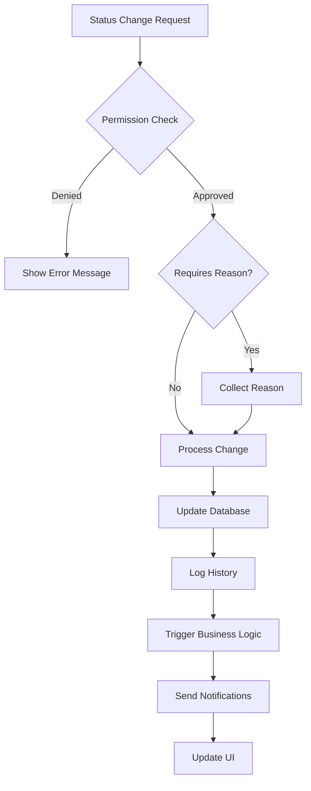
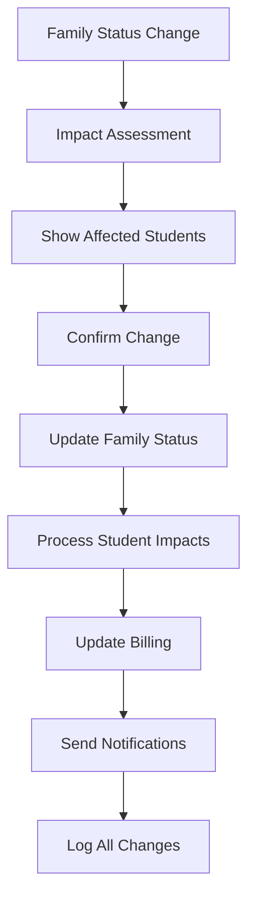

# Student and Family Status Management System Specification

## Overview
This specification defines a comprehensive status management system for students and families within the educational platform, providing administrators with granular control over record statuses and their associated business logic.

## 1. Student Status Management

### 1.1 Status Options
Students will have the following status options:

| Status | Description | Business Logic |
|--------|-------------|----------------|
| **Active** | Currently enrolled and participating | Default status for new students |
| **Inactive** | Temporarily not participating | Retains enrollment but excludes from active counts |
| **Graduated** | Successfully completed program | Historical record, cannot re-enroll in same program |
| **Transferred** | Moved to another institution | Maintains record for historical purposes |
| **Withdrawn** | Voluntarily left the program | Can be re-activated if they return |
| **Suspended** | Temporarily removed due to policy violation | Requires admin approval to reactivate |
| **On Hold** | Temporary pause (medical, financial, etc.) | Can be reactivated without restrictions |

### 1.2 User Interface Elements

#### 1.2.1 Student List View
```
┌─────────────────────────────────────────────────────────────┐
│ [Student Name]                                              │
│ Grade 5 • Age 10 • Intermediate                            │
│ ┌─────────────┐                                            │
│ │ ● Active    ▼│ ← Dropdown with status options            │
│ └─────────────┘                                            │
│ Email: student@example.com                                  │
│ Enrolled Classes: Piano Basics, Music Theory               │
└─────────────────────────────────────────────────────────────┘
```

#### 1.2.2 Student Detail Modal
```
┌─────────────────────────────────────────────────────────────┐
│ Student Details                                        [×]  │
├─────────────────────────────────────────────────────────────┤
│ Basic Information                                           │
│ Name: John Smith                                           │
│ Email: john@example.com                                    │
│                                                            │
│ Status Management                                          │
│ Current Status: [Active        ▼] [Save Status]           │
│ Status History: View History                               │
│                                                            │
│ ┌─────────────────────────────────────────────────────────┐ │
│ │ Status Change Reason (required for certain changes)    │ │
│ │ ┌─────────────────────────────────────────────────────┐ │ │
│ │ │ Enter reason for status change...                   │ │ │
│ │ └─────────────────────────────────────────────────────┘ │ │
│ └─────────────────────────────────────────────────────────┘ │
└─────────────────────────────────────────────────────────────┘
```

### 1.3 Status Change Validation Rules

| From Status | To Status | Validation Required | Auto-Actions |
|-------------|-----------|-------------------|--------------|
| Active | Inactive | Reason required | Pause billing |
| Active | Graduated | Completion verification | Generate certificate |
| Active | Transferred | Transfer documentation | Export records |
| Active | Withdrawn | Exit interview | Refund calculation |
| Active | Suspended | Incident report | Notify parents |
| Inactive | Active | Admin approval | Resume billing |
| Graduated | Any | Not allowed | N/A |
| Suspended | Active | Admin approval + review | Conditional reactivation |

## 2. Family Status Management

### 2.1 Status Options
Families will have a binary status system:

| Status | Description | Business Logic |
|--------|-------------|----------------|
| **Active** | Family is currently engaged with the institution | Default status, allows new enrollments |
| **Inactive** | Family is not currently engaged | Prevents new enrollments, retains historical data |

### 2.2 User Interface Elements

#### 2.2.1 Family List View
```
┌─────────────────────────────────────────────────────────────┐
│ Smith Family                                                │
│ 2 students • ● Active                                      │
│ ┌─────────────────────────────────────────────────────────┐ │
│ │ Family Status: [Active ▼] [Update]                     │ │
│ └─────────────────────────────────────────────────────────┘ │
│ Primary Contact: John Smith (john@example.com)             │
│ Students: [Alice Smith] [Bob Smith]                        │
└─────────────────────────────────────────────────────────────┘
```

#### 2.2.2 Family Detail Modal
```
┌─────────────────────────────────────────────────────────────┐
│ Family Details                                         [×]  │
├─────────────────────────────────────────────────────────────┤
│ Family Information                                          │
│ Family Name: Smith Family                                  │
│                                                            │
│ Status Management                                          │
│ ┌─────────────────────────────────────────────────────────┐ │
│ │ Family Status: ○ Active  ○ Inactive                    │ │
│ │ [Save Status Change]                                   │ │
│ └─────────────────────────────────────────────────────────┘ │
│                                                            │
│ Impact Assessment:                                         │
│ • 2 active students will be affected                      │
│ • 1 upcoming enrollment will be cancelled                 │
│                                                            │
│ ┌─────────────────────────────────────────────────────────┐ │
│ │ Reason for Status Change                               │ │
│ │ ┌─────────────────────────────────────────────────────┐ │ │
│ │ │ Family relocated to another state...                │ │ │
│ │ └─────────────────────────────────────────────────────┘ │ │
│ └─────────────────────────────────────────────────────────┘ │
└─────────────────────────────────────────────────────────────┘
```

## 3. Database Schema Changes

### 3.1 Student Table Updates
```sql
-- Add status and tracking fields to students table
ALTER TABLE students 
ADD COLUMN status VARCHAR(20) DEFAULT 'active' NOT NULL,
ADD COLUMN status_changed_at TIMESTAMP DEFAULT CURRENT_TIMESTAMP,
ADD COLUMN status_changed_by VARCHAR(255),
ADD COLUMN status_change_reason TEXT;

-- Create index for efficient status queries
CREATE INDEX idx_students_status ON students(status);
CREATE INDEX idx_students_status_changed_at ON students(status_changed_at);
```

### 3.2 Family Table Updates
```sql
-- Add status and tracking fields to families table
ALTER TABLE families 
ADD COLUMN status VARCHAR(20) DEFAULT 'active' NOT NULL,
ADD COLUMN status_changed_at TIMESTAMP DEFAULT CURRENT_TIMESTAMP,
ADD COLUMN status_changed_by VARCHAR(255),
ADD COLUMN status_change_reason TEXT;

-- Create index for efficient status queries
CREATE INDEX idx_families_status ON families(status);
```

### 3.3 Status History Table
```sql
-- Create status history tracking table
CREATE TABLE status_history (
    id UUID PRIMARY KEY DEFAULT gen_random_uuid(),
    entity_type VARCHAR(20) NOT NULL, -- 'student' or 'family'
    entity_id UUID NOT NULL,
    old_status VARCHAR(20),
    new_status VARCHAR(20) NOT NULL,
    changed_by UUID NOT NULL, -- Reference to users table
    change_reason TEXT,
    changed_at TIMESTAMP DEFAULT CURRENT_TIMESTAMP,
    metadata JSONB -- Additional context data
);

-- Create indexes for efficient queries
CREATE INDEX idx_status_history_entity ON status_history(entity_type, entity_id);
CREATE INDEX idx_status_history_changed_at ON status_history(changed_at);
CREATE INDEX idx_status_history_changed_by ON status_history(changed_by);
```

## 4. Permission System

### 4.1 Role-Based Access Control

| Role | Student Status Permissions | Family Status Permissions |
|------|---------------------------|---------------------------|
| **Admin** | Full access to all status changes | Full access to all status changes |
| **Teacher** | Can view all, change Active ↔ Inactive only | View only |
| **Parent** | View own children only | View own family only |
| **Student** | View own status only | View own family only |

### 4.2 Permission Matrix

```typescript
interface StatusPermissions {
  canView: boolean;
  canEdit: boolean;
  allowedTransitions: string[];
  requiresApproval: boolean;
  requiresReason: boolean;
}

const PERMISSION_MATRIX = {
  admin: {
    student: {
      canView: true,
      canEdit: true,
      allowedTransitions: ['*'], // All transitions allowed
      requiresApproval: false,
      requiresReason: true
    },
    family: {
      canView: true,
      canEdit: true,
      allowedTransitions: ['active', 'inactive'],
      requiresApproval: false,
      requiresReason: true
    }
  },
  teacher: {
    student: {
      canView: true,
      canEdit: true,
      allowedTransitions: ['active', 'inactive', 'on_hold'],
      requiresApproval: true,
      requiresReason: true
    },
    family: {
      canView: true,
      canEdit: false,
      allowedTransitions: [],
      requiresApproval: false,
      requiresReason: false
    }
  }
};
```

## 5. Business Logic and Relationships

### 5.1 Family-Student Status Relationships

#### 5.1.1 When Family Status Changes to Inactive:
1. **Automatic Actions:**
   - All active students in the family are flagged for review
   - New enrollments are blocked
   - Billing is suspended
   - Notification sent to administrators

2. **Manual Review Required:**
   - Admin must decide individual student statuses
   - Options: Keep active, set to inactive, or transfer

#### 5.1.2 When Family Status Changes to Active:
1. **Automatic Actions:**
   - Re-enable enrollment capabilities
   - Resume billing for active students
   - Send welcome back notification

### 5.2 Status Change Workflows

#### 5.2.1 Student Status Change Workflow


#### 5.2.2 Family Status Change Workflow


## 6. Implementation Requirements

### 6.1 Frontend Components

#### 6.1.1 StatusDropdown Component
```typescript
interface StatusDropdownProps {
  currentStatus: string;
  entityType: 'student' | 'family';
  entityId: string;
  allowedStatuses: string[];
  onStatusChange: (newStatus: string, reason?: string) => void;
  disabled?: boolean;
}
```

#### 6.1.2 StatusHistory Component
```typescript
interface StatusHistoryProps {
  entityType: 'student' | 'family';
  entityId: string;
  maxEntries?: number;
}
```

#### 6.1.3 StatusChangeModal Component
```typescript
interface StatusChangeModalProps {
  isOpen: boolean;
  entityType: 'student' | 'family';
  currentStatus: string;
  newStatus: string;
  requiresReason: boolean;
  impactAssessment?: string[];
  onConfirm: (reason: string) => void;
  onCancel: () => void;
}
```

### 6.2 Backend Services

#### 6.2.1 StatusService
```typescript
class StatusService {
  async changeStudentStatus(
    studentId: string, 
    newStatus: string, 
    reason: string, 
    changedBy: string
  ): Promise<void>;
  
  async changeFamilyStatus(
    familyId: string, 
    newStatus: string, 
    reason: string, 
    changedBy: string
  ): Promise<void>;
  
  async getStatusHistory(
    entityType: string, 
    entityId: string
  ): Promise<StatusHistoryEntry[]>;
  
  async validateStatusChange(
    entityType: string, 
    currentStatus: string, 
    newStatus: string, 
    userRole: string
  ): Promise<ValidationResult>;
}
```

### 6.3 Notification System

#### 6.3.1 Status Change Notifications
- **Email Notifications:** Sent to relevant parties when status changes
- **In-App Notifications:** Real-time updates for administrators
- **Audit Logs:** Comprehensive logging for compliance

## 7. Testing Requirements

### 7.1 Unit Tests
- Status validation logic
- Permission checking
- Business rule enforcement
- Database operations

### 7.2 Integration Tests
- End-to-end status change workflows
- Family-student relationship handling
- Notification delivery
- Audit trail accuracy

### 7.3 User Acceptance Tests
- Admin can change any status with proper reason
- Teachers have limited status change capabilities
- Parents can only view their family/student statuses
- Status changes trigger appropriate business logic

## 8. Migration Strategy

### 8.1 Data Migration
1. **Phase 1:** Add new columns with default values
2. **Phase 2:** Migrate existing data to new status system
3. **Phase 3:** Update application code to use new status fields
4. **Phase 4:** Remove old status indicators

### 8.2 Rollback Plan
- Maintain old status fields during transition period
- Implement feature flags for gradual rollout
- Prepare rollback scripts for emergency situations

## 9. Monitoring and Analytics

### 9.1 Key Metrics
- Status change frequency by type
- Most common status transitions
- Time between status changes
- User adoption of new status features

### 9.2 Alerts
- Unusual status change patterns
- Failed status change attempts
- Permission violations
- System errors during status updates

## 10. Future Enhancements

### 10.1 Planned Features
- Bulk status change operations
- Automated status changes based on rules
- Integration with external systems
- Advanced reporting and analytics

### 10.2 Considerations
- Multi-tenant support for different institutions
- Custom status types per organization
- Workflow approval chains
- Integration with learning management systems